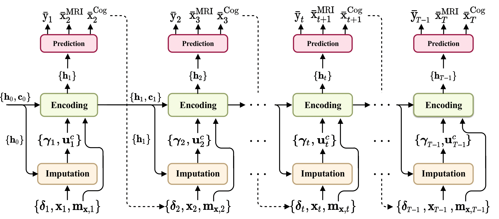

## Deep Recurrent Model for Individualized Prediction of Alzheimer’s Disease Progression
<p align="center"></p>

This repository provides the official PyTorch implementation of the following paper:
> **Deep Recurrent Model for Individualized Prediction of Alzheimer’s Disease Progression**<br>
> [Wonsik Jung](https://github.com/ssikjeong1/)<sup>1</sup>, [Eunji Jun](https://github.com/ejjun92)<sup>1</sup>, [Heung-Il Suk](https://scholar.google.co.kr/citations?user=dl_oZLwAAAAJ&hl=ko)<sup>1</sup> 
> (<sup>1</sup>Korea University) <br/>
> [[Official version]](https://www.sciencedirect.com/science/article/pii/S1053811921004201?via%3Dihub)
> [[ArXiv version]](https://arxiv.org/abs/2005.02643) <br>
> Published in NeuroImage (JCR-IF: 5.902, 2020)
> 
> **Abstract:** *Alzheimer’s disease (AD) is known as one of the major causes of dementia and is characterized by slow progression over several years, with no treatments or available medicines. In this regard, there have been efforts to identify the risk of developing AD in its earliest time. While many of the previous works considered cross-sectional analysis, more recent studies have focused on the diagnosis and prognosis of AD with longitudinal or time series data in a way of disease progression modeling. Under the same problem settings, in this work, we propose a novel computational framework that can predict the phenotypic measurements of MRI biomarkers and trajectories of clinical status along with cognitive scores at multiple future time points. However, in handling time series data, it generally faces many unexpected missing observations. In regard to such an unfavorable situation, we define a secondary problem of estimating those missing values and tackle it in a systematic way by taking account of temporal and multivariate relations inherent in time series data. Concretely, we propose a deep recurrent network that jointly tackles the four problems of (i) missing value imputation, (ii) phenotypic measurements forecasting, (iii) trajectory estimation of a cognitive score, and (iv) clinical status prediction of a subject based on his/her longitudinal imaging biomarkers. Notably, the learnable parameters of all the modules in our predictive models are trained in an end-to-end manner by taking the morphological features and cognitive scores as input, with our circumspectly defined loss function. In our experiments over The Alzheimers Disease Prediction Of Longitudinal Evolution (TADPOLE) challenge cohort, we measured performance for various metrics and compared our method to competing methods in the literature. Exhaustive analyses and ablation studies were also conducted to better confirm the effectiveness of our method.*

## Dependencies
* [Python 3.6+](https://www.continuum.io/downloads)
* [PyTorch 0.4.0+](http://pytorch.org/)
* [TensorFlow 1.3+](https://www.tensorflow.org/) (optional for tensorboard)

## Downloading datasets
To download the TADPOLE dataset
* https://tadpole.grand-challenge.org/Data/#Data
* https://github.com/tadpole-share/TADPOLE-share

## Usage
For training:

`python main.py --dataset='Zero' --data_path=PATH --kfold=5 --impute_weigh=0.1 --reg_weight=0.5 --label_weight=0.5 --gamma=5.0 --cognitive_score=True`

## Citation
If you find this work useful for your research, please cite our [paper](https://www.sciencedirect.com/science/article/pii/S1053811921004201?via%3Dihub):
```
@article{jung2021deep,
  title={Deep recurrent model for individualized prediction of Alzheimer’s disease progression},
  author={Jung, Wonsik and Jun, Eunji and Suk, Heung-Il and Alzheimer’s Disease Neuroimaging Initiative and others},
  journal={NeuroImage},
  volume={237},
  pages={118143},
  year={2021},
  publisher={Elsevier}
}
```

## Acknowledgements
This work was supported by Institute for Information communications Technology Planning & Evaluation (IITP) grant funded by the Korea government (MSIT) (No.2019-0-00079, Artificial Intelligence Graduate School Program (Korea University)) and the National Research Foundation of Korea (NRF) grant funded by the Korea government (MSIT) (No. 2019R1A2C1006543).
